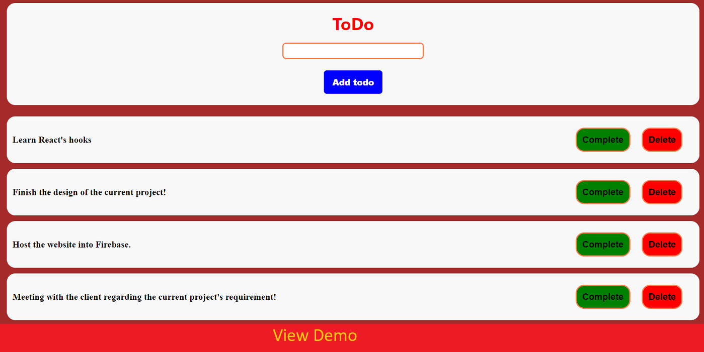

# React ToDo App
<a href="https://todo-app-5f8a6.web.app/"></a>

<br />

## Build setup

- Clone the repo.
```bash
$ git clone https://github.com/ankitrhode/React-ToDo.git
```

- Install dependencies. Make sure you already have [`nodejs`](https://nodejs.org/en/) & [`npm`](https://www.npmjs.com/) installed in your system.
```bash
$ npm install # or yarn
```

- Run it and serve at localhost:3000
```bash
$ npm start # or yarn start
```

<br />

## Technology Stack

- React (Frontend)
- Firebase (Backend + Hosting)
- HTML
- CSS
- JavaScript

<br />
